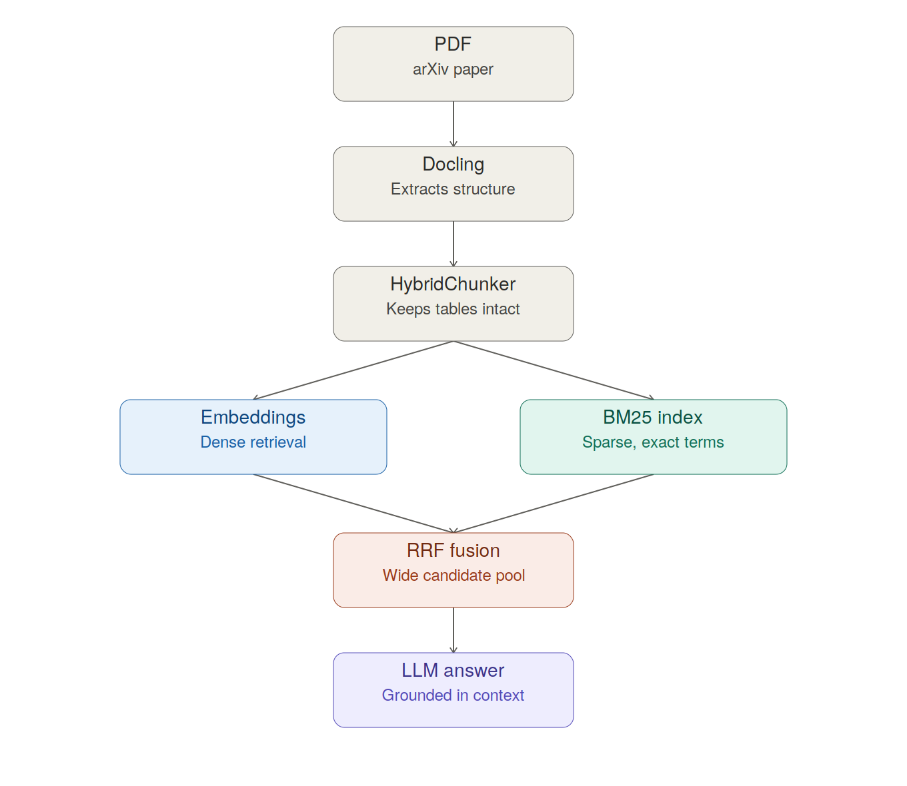

# RAG Pipeline Demo

A Retrieval-Augmented Generation (RAG) pipeline that extracts and queries knowledge from a research paper using Python, OpenAI, ChromaDB, Docling, and BM25.

## Paper

[DeepSeek-R1: Incentivizing Reasoning Capability in LLMs via Reinforcement Learning](https://arxiv.org/abs/2501.12948) — Guo et al., 2025

## Stack

- **Docling** — PDF to structured document extraction, structure-aware chunking (`HybridChunker`)
- **OpenAI API** — Embeddings + LLM (GPT-4o-mini)
- **ChromaDB** — Vector store (dense retrieval)
- **BM25 (rank_bm25)** — Sparse retrieval
- Dense and sparse retrieval are combined via Reciprocal Rank Fusion

## Workflow

PDF → Structured Document (Docling) → Structure-aware Chunks (HybridChunker) → Embeddings (OpenAI) + BM25 index → Hybrid Retrieval (Reciprocal Rank Fusion) → LLM Query

## Setup

1. Clone the repo
2. Install dependencies: `pip install -r requirements.txt`
3. Copy `.env.example` to `.env` and add your own OpenAI API key — the `.env` file itself is gitignored and not included in this repo, since committing an API key would expose it publicly
4. Start Docling: see `docker-compose.yml` in the repo
5. Run `notebook.ipynb` top to bottom

## Notes

- `data/raw/` and `data/processed/` are gitignored — both are generated automatically by the notebook (PDF download, Docling extraction)
- See the notebook's Summary section for a walkthrough of a real retrieval bug found and fixed during development (table caption/data separation, RRF candidate pooling, BM25 tokenization)